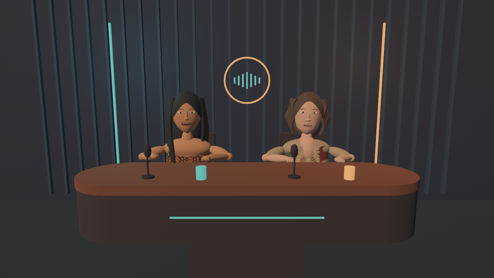

# slofox

A Rust/Bevy app that renders two cartoon talk show hosts in a 3D studio.
Host 1 reacts to ChatGPT's browser audio; host 2 reacts to your microphone.
OBS records the app window and the two audio channels.



## Prototype

- Two lightweight, procedural 3D upper-body avatars inspired by the supplied
  portraits: long black hair and an orange/navy top for host 1; shoulder-length
  brown hair with lighter strands and a patterned shirt for host 2.
- Independent audio-driven mouth opening, with a noise threshold and smooth
  attack/release. This version uses volume, not phoneme recognition.
- Blinking, breathing, head turns, leaning and speech-dependent arm gestures.
- A shared desk, studio lighting, microphones and three smoothly changing
  camera angles. Rendering starts at 1280 × 720 with a 30 fps target.
- A diagnostic overlay showing both audio levels and capture status, which can
  be hidden for recording. Rendering continues while the browser has focus.
- A silent demo mode that does not access the microphone or browser audio.

The avatars are initial stylized interpretations, not detailed likenesses.
Their geometry is generated locally; no portrait files or external art assets
are bundled. Live audio capture currently requires Linux and PipeWire.
The renderer and demo use Bevy's platform-independent APIs; Windows/macOS
builds and audio backends have not been tested yet.

## Build and demo

Requires Rust 1.95 or newer and a Vulkan-capable GPU/driver on Linux. The
initial build downloads and compiles Bevy and can take several minutes.

On Debian 13 with GNOME/Wayland, install the runtime and build tools if missing:

```sh
sudo apt install build-essential libwayland-client0 libxkbcommon0 mesa-vulkan-drivers pipewire-bin pavucontrol obs-studio
cargo run --locked -- --demo
```

For recording, use an optimized build:

```sh
cargo build --release --locked -j 2
./target/release/slofox --demo --clean --auto-camera
```

Wayland libraries are loaded dynamically, so Wayland development packages are
not needed. X11 support is also enabled. All animation is computed locally;
Slofox does not connect to ChatGPT, need an API key, send audio anywhere, or
save audio files.

## Connect Firefox or Chrome and your microphone

1. Create a temporary, dedicated browser output in a separate terminal:

   ```sh
   bash scripts/browser-audio.sh
   ```

   Keep it running. Its playback side forwards browser audio to your current
   default output, so you can still hear ChatGPT. Prefer headphones to keep
   ChatGPT's voice out of the microphone.

2. Play ChatGPT audio in Firefox or Chrome. Open `pavucontrol`, then in
   **Playback** change that browser's output to **Slofox Browser**. This routes
   that browser's playback streams, not just one tab; keep other browser audio
   quiet during recording. The script does not change your default output or
   automatically move any existing streams.

3. List available inputs and outputs:

   ```sh
   ./target/release/slofox --list-devices
   ```

4. Start the studio:

   ```sh
   ./target/release/slofox --browser slofox_browser --microphone auto
   ```

   `auto` uses the default microphone. To select another one, pass its
   `node.name` or `object.serial` from the device list. For host 1, select an
   output sink; Slofox captures its monitor ports. Using the dedicated browser
   sink prevents unrelated desktop sounds from driving that avatar.

5. Speak and play ChatGPT audio separately. Check that only the corresponding
   host's meter and mouth respond. Both channels can also animate simultaneously.
   Press **H** to hide diagnostics once the levels look right.

6. Quit Slofox with **Esc**, then stop the routing script with **Ctrl+C**. The
   temporary sink disappears. If needed, select your normal browser output
   again in `pavucontrol`.

Slofox starts two `pw-record` subprocesses and reads raw mono float audio at
48 kHz in 10 ms blocks. The processes are stopped on normal app exit. Device
selection is done at startup; after unplugging a device or restarting PipeWire,
restart the app. Capture failures appear in diagnostics and the terminal.

## Controls and tuning

| Key | Action |
| --- | --- |
| H | Show/hide the diagnostic overlay |
| 1 | Front camera |
| 2 | Camera from the left |
| 3 | Camera from the right |
| A | Enable/disable automatic camera changes every 14 seconds |
| Esc | Quit |

```sh
./target/release/slofox --help
./target/release/slofox --browser-gain 12 --microphone-gain 6 --threshold 0.012
./target/release/slofox --browser-delay-ms 100 --microphone-delay-ms 50
./target/release/slofox --demo --clean --seconds 12 --screenshot /tmp/slofox.png
```

Gains change mouth sensitivity, not recorded volume. The threshold is a linear
RMS noise gate. Each input has its own bounded, timestamped analysis buffer.
Positive delay settings postpone that host's mouth movement by up to 2000 ms;
use OBS audio offsets when the sound needs delaying instead. The screenshot
option captures only the app window after five seconds; use a longer run when
combining it with `--seconds`.

`--fps` sets the frame pacing target (15–120 fps), not a guaranteed frame
rate. Actual performance depends on the GPU, driver, OBS settings and window
size. The diagnostic panel shows measured fps. Resize the window if a different
resolution is needed.

## Record with OBS on GNOME/Wayland

1. Set OBS's canvas and output to **1280 × 720**, **30 fps**.
2. Add **Screen Capture (PipeWire)** / **Window Capture (PipeWire)**, depending
   on your OBS version, and choose the Slofox window in GNOME's sharing dialog.
3. Add an **Audio Output Capture (PulseAudio)** source selecting **Slofox Browser**,
   plus an **Audio Input Capture (PulseAudio)** source selecting the same
   microphone as Slofox. PipeWire's PulseAudio compatibility service exposes
   these devices. Source labels can differ between OBS versions.
4. Disable any duplicate global Desktop Audio/Mic sources. Disable OBS audio
   monitoring for these sources to avoid echo or feeding audio back into capture.
5. In Advanced Audio Properties, put both voices on the mixed track and,
   optionally, each on its own additional track. Recording to MKV allows
   separate audio tracks; OBS can remux the recording later.
6. Make a short test recording with alternating speech. Adjust Slofox's
   per-input mouth delays or OBS's per-source audio synchronization offsets
   until sound and movement match, then hide the diagnostic overlay.

Slofox outputs video through its window. OBS captures the original audio
directly, so Slofox does not replay or mix the microphone. End-to-end OBS
synchronization must be checked on the recording machine.

## Development

```sh
cargo fmt --check
cargo test --locked
cargo clippy --locked --all-targets -- -D warnings
```

An optional integration test exercises real PipeWire sink capture and channel
separation without opening the microphone or playing sound on your speakers:

```sh
cargo test --locked --test pipewire -- --ignored
```

It requires a running PipeWire session and creates two temporary null sinks
and virtual browser/microphone nodes. It tests both sink-monitor and source capture.
It is skipped in the normal test suite.

`src/audio.rs` separates capture, timestamped buffering, RMS analysis and the
smoothed `SpeechPose`. It reserves lip-rounding and lip-width coefficients for
a future phoneme/viseme backend; this prototype only drives the jaw coefficient.
`src/studio.rs` builds the replaceable avatar geometry and stage;
`src/main.rs` connects analysis to animation, cameras and diagnostics.

Future steps include rigged glTF models with mouth blend shapes, speech-derived
visemes, more varied gestures, GUI device selection and native audio backends
for other operating systems.

Reference documentation: [Bevy](https://bevy.org/),
[PipeWire loopback](https://docs.pipewire.org/page_module_loopback.html),
[pw-cat/pw-record](https://docs.pipewire.org/page_man_pw-cat_1.html),
[OBS window capture](https://obsproject.com/kb/window-capture-sources).

## License

This project is dual-licensed under the [MIT License](LICENSE-MIT) or the
[Apache License, Version 2.0](LICENSE-APACHE), at your option.

SPDX license expression: `MIT OR Apache-2.0`.
